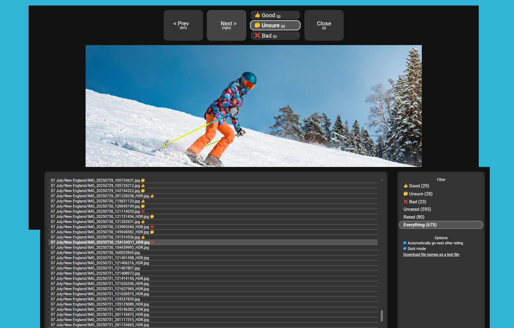

# Photo Reviewer 4Net

Do you or a significant other want to sit on the couch, go through your family
photos and videos on the TV, and give them a thumbs up, thumbs down, or "I don't
know yet" rating?  Then, safely move or delete unnecessary files that *everyone
agrees* are wasting space and costing money to backup?

The browser-based UI is designed to be simple for the whole family to use,
whether they're technical or not.  Run the CLI program on your
media server, and access its web UI from any device on your WIFI network.

After the ratings are input, you can get the list of "Bad" filenames (or any
other rating you want) and feed them into any standard CLI tool, to move,
archive, resize, or delete them.  (See the examples below.)

You control all modification actions &mdash; Photo Reviewer 4Net just gives you
the list of files!




## Installation

Photo Reviewer 4Net runs on Linux, Mac, or Windows.  It's a small, modular, UNIX-philosophy tool,
and there's no configuration file.


### Quickstart - UNIX

To build the app, you need `dotnet` 8.0 or later installed.  That version was released
in 2023, so most distros should have it available.

````
git clone https://github.com/kjpgit/PhotoReviewer4Net
cd PhotoReviewer4Net
dotnet publish -o /tmp/photo_reviewer_build
````

Verify you can run it and see the help, then run it on a real directory:

````
/tmp/photo_reviewer_build/photo_reviewer_4net --help
/tmp/photo_reviewer_build/photo_reviewer_4net ~/Pictures/2025 /tmp/ratings.json
````

For fun, in another terminal window you can run `watch cat /tmp/ratings.json`
and see when the web UI adds ratings in real time.


### Quickstart - Docker

You can easily run a containerized version as shown below.  It has read-only
access to the media directory you specify, and write access to /tmp/ratings/ to
save state.

````
mkdir /tmp/ratings   # The app can write a ratings file in this dir only

docker run --init -p 8080:8080 \
    -v ~/Pictures/2025:/media:ro \
    -v /tmp/ratings:/tmp/ratings:rw \
    public.ecr.aws/p5e0b0g4/kjpgit/photo_reviewer_4net:latest /media /tmp/ratings/ratings.json
````


### Quickstart - Windows

Download the [prebuilt binary zipfile](https://github.com/kjpgit/PhotoReviewer4Net/releases/download/1.1/PhotoReviewer4Net.zip) and extract it to `Downloads\PhotoReviewer4Net\`.

Start a PowerShell terminal (open the start menu and type "powersh" to find it).

Verify you can run it and see the help, then run it on a real directory:

````
~\Downloads\PhotoReviewer4Net\photo_reviewer_4net.exe --help
~\Downloads\PhotoReviewer4Net\photo_reviewer_4net.exe ~\Pictures\2025 c:\temp\ratings.json
````

### Accessing the Web Interface

You can open http://localhost:8080 with your web browser.

By default, the app only accepts connections from the same device (localhost).  If you
are on a private, trusted WIFI or LAN, use the `-a` option to listen on
`0.0.0.0:8080`.  You can also change the port with the `-p` option.


## Managing Rated Files

Here are examples on how to list, move, or delete (with confirmation) files
that have a "Bad" rating.  Please review all commands carefully before running!

### UNIX

````sh
# Get files with a "Bad" rating (null terminated)
photo_reviewer_4net --print0 /tmp/ratings.json Bad > /tmp/files.txt

# List filenames, sizes, and modification times
cat /tmp/files.txt | xargs -0 ls -l

# Delete files with interactive confirmation
cat /tmp/files.txt | xargs -0 -o rm -v -i
````

For moving files, see [Moving Files on UNIX](doc/moving_files_on_unix.md)


### Windows (PowerShell)

````PowerShell
# Get files with a "Bad" rating (newline terminated)
photo_reviewer_4net.exe --println c:\temp\ratings.json Bad > c:\temp\files.txt

# List file sizes
Get-Content -path c:\temp\files.txt | ForEach-Object { Get-ItemProperty -Path $_ }

# Move files to the target directory c:\temp\badfiles
# CAREFUL: Any subdirectory information is lost, they all go to one directory!
mkdir c:\temp\badfiles
Get-Content -path c:\temp\files.txt | ForEach-Object { Move-Item -Confirm -Path $_ -Destination c:\temp\badfiles }

# (or) Delete files with interactive confirmation
Get-Content -path c:\temp\files.txt | ForEach-Object { Remove-Item -Confirm -Path $_ }
````


## FAQ

* Can I make it *full screen*?  Yes.  Press `f` or double-click when viewing a video or
image.

* Can the top controls *hide faster*?  Make sure the mouse isn't over a button,
  and it will hide faster.  Also, the controls won't show if you're
  using the keyboard shortcuts.

* Does it have *light and dark* modes?  Yes.  You can easily tweak the themes in
  [colors.css](wwwroot/css/colors.css).

* Is the ratings.json file supposed to be *long-lived*, or contain *all* my media
  files?  Not really.  My use case is to review this year's
pictures, delete the "Bad" rated pictures, then delete the output json.
(There's no need to keep ratings for files that no longer exist.)

* Does the web interface work on *iPad/tablet*?  It runs admirably, but it
  wasn't designed for that form factor.

* Why *C#*?  Because it's maintained by adults and doesn't nag me with bullsh-t.

* Why *Vanilla JS*?  I'm an old backend developer who values stability and minimal churn.  And I've
  tested it with 15,000 files loaded.

* Does it use any *third-party libraries*?  Only normalize.css, to appease the
  wrathful browser gods.

* Was *"AI"* used to make it?  It was not used to create it, but another person
  did some QA on the 1.0 version with it.

* What did you *learn* from this project?  It is a great "full stack" challenge
  &mdash; frontend / backend / APIs / races / cross-platform / documentation &mdash; in
only 500&ndash;1000 lines of code.  Simple requirements, but very rewarding
based on how deep you go.

* Why did you make this program?  It was a Christmas present for my wife (high
  WAF is not a joke), and she greatly appreciated the effort... and the
  improvement over our old tools.


## License

* If you are a human, you may use and modify this code.
<sup> [1](doc/license_explanation.md) </sup>

* Copyright © 2025 Karl Pickett

Enjoy 👍
